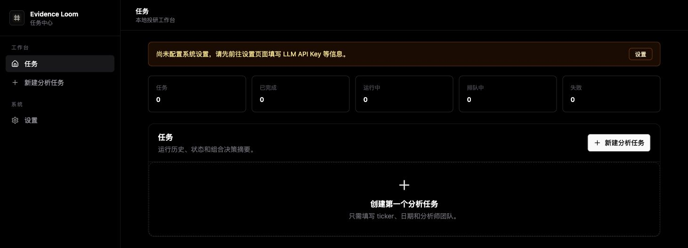

# Evidence Loom

[](https://github.com/simonguo/evidenceloom/actions/workflows/ci.yml)
[](https://github.com/simonguo/evidenceloom/actions/workflows/codeql.yml)
[](LICENSE)

Evidence Loom is a local-first desktop workspace for multi-agent market research. It packages a Next.js interface, a Tauri desktop shell, and an embedded [TradingAgents](https://github.com/TauricResearch/TradingAgents) research core into one auditable workflow.

> Evidence Loom is an independent community project and is not affiliated with or endorsed by TauricResearch. Outputs are generated from probabilistic models and third-party data. They are not financial, investment, legal, or trading advice.

[中文说明](README_zh.md)



## What it does

- Coordinates market, sentiment, news, fundamentals, research, trading, and risk agents.
- Runs locally through a packaged sidecar on desktop; no Evidence Loom cloud account is required.
- Keeps task history and reports on the device.
- Stores desktop API keys in macOS Keychain or Windows Credential Manager.
- Supports OpenAI-compatible APIs, Anthropic, Google, Azure OpenAI, DeepSeek, Qwen, GLM, MiniMax, OpenRouter, and local/custom endpoints.

## Supported platforms

| Platform | Installer | Source build |
| --- | --- | --- |
| macOS Apple Silicon | Signed and notarized DMG | Supported |
| macOS Intel | Signed and notarized DMG | Supported |
| Windows x64 | Authenticode-signed installer | Supported |
| Linux | Not published for the first release | Supported for technical users |

Only download installers from this repository's [GitHub Releases](https://github.com/simonguo/evidenceloom/releases). A release is withheld when platform signing or notarization cannot be completed.

## Run from source

Prerequisites: Python 3.10–3.13, [uv](https://docs.astral.sh/uv/), Node.js 22 with npm, and Rust 1.95.

```bash
git clone https://github.com/simonguo/evidenceloom.git
cd evidenceloom
cp .env.example .env
uv sync --locked --group dev
npm --prefix frontend ci
```

Start the browser development UI at `http://localhost:31741`:

```bash
npm --prefix frontend run dev
```

Start the Tauri development app:

```bash
npm --prefix frontend run tauri:dev
```

Run the upstream-compatible CLI:

```bash
uv run tradingagents
```

Run the Docker CLI environment:

```bash
docker compose run --rm evidenceloom
```

## Architecture and data flow

```text
Next.js UI
  ├─ web development mode → local Next.js API routes → Python research core
  └─ desktop mode → restricted Tauri IPC → Rust process controller → packaged Python sidecar
                                                        ├─ LLM provider APIs
                                                        └─ market/news data providers
```

Desktop settings and task metadata use a local SQLite database. Secret values are never returned by desktop snapshot APIs: Rust retrieves them from the operating-system credential store and injects them only into the sidecar process. Web-mode keys stay in memory for the current browser session and are not written to localStorage.

Prompts, tickers, dates, retrieved market context, and generated content may be sent to the model and data providers you configure. Provider billing, retention, geographic processing, and acceptable-use terms apply independently. Review [PRIVACY.md](PRIVACY.md) before using real portfolio information.

## Development checks

```bash
uv lock --check
uv run ruff check .
uv run ruff format --check .
uv run pytest

npm --prefix frontend run lint
npm --prefix frontend run typecheck
npm --prefix frontend test
npm --prefix frontend run build
npm --prefix frontend audit --audit-level=high

cargo fmt --manifest-path src-tauri/Cargo.toml --check
cargo clippy --manifest-path src-tauri/Cargo.toml --all-targets --locked -- -D warnings
cargo test --manifest-path src-tauri/Cargo.toml --locked
```

Build outputs and architecture-specific sidecars are generated locally and must not be committed. See [frontend/SIDECAR.md](frontend/SIDECAR.md) and [frontend/DESKTOP_DISTRIBUTION.md](frontend/DESKTOP_DISTRIBUTION.md) for packaging details.

## Troubleshooting

- **The desktop app reports a missing sidecar:** build the runner for the same Rust target as the app by following [frontend/SIDECAR.md](frontend/SIDECAR.md); never rename a runner built for another architecture.
- **A provider is still shown as unconfigured:** save its key again and approve the macOS Keychain or Windows Credential Manager prompt. Evidence Loom deliberately does not fall back to plaintext storage.
- **Port 31741 is already in use:** stop the conflicting process or set a different development port consistently in the frontend and Tauri development configuration.
- **A clean install fails:** confirm the supported Python, Node, npm, and Rust versions above, then run the commands with `--locked`/`npm ci`; do not regenerate lockfiles as a workaround.
- **Model or market-data requests fail:** verify the selected provider, endpoint, account quota, regional availability, and symbol format. See [SUPPORT.md](SUPPORT.md) before opening an issue.

## Community and security

- Contributions: [CONTRIBUTING.md](CONTRIBUTING.md) and [DCO.md](DCO.md)
- Security reports: [SECURITY.md](SECURITY.md)
- Support boundaries: [SUPPORT.md](SUPPORT.md)
- Privacy and threat model: [PRIVACY.md](PRIVACY.md)
- Upstream provenance: [UPSTREAM.md](UPSTREAM.md)

## License and upstream

Evidence Loom is licensed under [Apache License 2.0](LICENSE). It includes a modified copy of TradingAgents, pinned to upstream tag `v0.2.5` at commit `a5cb7cbd61d217fb0bc43f017392a861257afe6a`. The internal Python module remains named `tradingagents` for upstream compatibility; Evidence Loom does not publish that name to PyPI.

See [NOTICE](NOTICE), [MODIFICATIONS.md](MODIFICATIONS.md), [UPSTREAM.md](UPSTREAM.md), and [THIRD_PARTY_NOTICES.md](THIRD_PARTY_NOTICES.md) for attribution, modifications, and dependency licensing.
