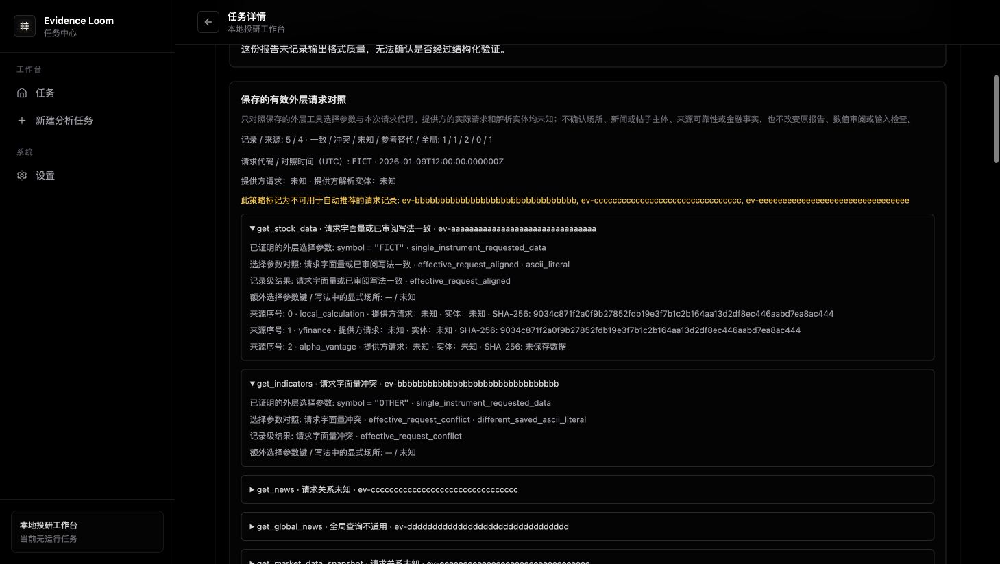

# Effective outer-request alignment validation — 2026-10-04

This candidate adds the scoped [v1 assessment](../EFFECTIVE_REQUEST_IDENTITY.md)
on top of the saved numeric review branch (base `4b12384`, PR #87). The product
objective remains open. All cases here use fictional saved inputs; validation
makes no provider or model requests and uses no gateway credentials.

## Behavior and contract

The frozen policy compares the sole documented outer selector for each tool
against the saved run identifier. Explicit conflicts are persisted as withheld
before retrieval and replay. Unknown/proxy relations remain observable. Before
PM use, unsafe saved request records force a cited `REVIEW` without a manager
model call. Completion checks original decision prose and typed rating before
recording Memory, then binds one immutable assessment to final Evidence and the
original report snapshot.

Every record and every indexed source is covered, including non-head and
null-data sources. Python, TypeScript and Rust independently rederive results;
coherently rehashed false alignment, omitted conflicts or sources, changed
owners and invalid clocks are rejected. The 62 shared selector cases include
ASCII trimming/case, explicit mainland venues, bounded HK notation, unresolved
qualification, declared proxies, pair namespaces, non-ASCII input, tool scope
and extra selector metadata.

The policy SHA-256 is
`933c826dc91d445488363e984acb5b66a5082fe548efbc4cfe930a7e71b5aa23`.
The shared fixture's physical SHA-256 is
`031c86614c09ff9df83f996a16b45175161266bd953f053148dc026e04d075d9`;
the separately marked fixture's is
`9851973f3376efe99c6589a49086c8f1207547b79376c115fcb4d0f16c8a1dc4`.
Existing Numeric v1 policy/fixture bytes are unchanged.

Old unmarked versions retain unknown absence and ordinary export. Marked
completed versions require a valid assessment or a visible invalid diagnostic.
Invalid diagnostics block all report exports; an unknown policy marker is not
validated by retaining its diagnostic. Unmarked archives may show a dated
conflict assessment alongside unchanged original prose.

Independent browser-storage regressions confirmed imported task/version
hybrids could spoof owners of existing Evidence, Memory, Readiness and Numeric
attachments. The candidate rejects ambiguous owners in both directions and
binds each retained attachment to actual task/version metadata. No inherited
v1 business or arithmetic contract is rewritten.

## Local source and packaged validation

The isolated frozen environment uses Python 3.10.4 on macOS through Rosetta,
Node 24.12.0 and Rust 1.95.0. CI uses the repository's supported platform/version
matrix. Local results:

| Check | Result |
| --- | --- |
| Full Python suite | 1,365 passed, 75 subtests passed, one integration deselected; 170.38 seconds |
| Python lint/format | Ruff check and format check passed |
| Native source tests | 96 passed, two packaged tests ordinarily ignored; 5.90 seconds |
| Native lint/format | All-target Clippy with warnings denied and rustfmt passed |
| Full frontend tests | 507 passed in 37 files |
| Frontend checks/builds | Typecheck, full ESLint, static and production builds passed |
| Packaged Python bootstrap + runtime import | Passed within the unchanged shared 90-second deadline; 85.274 seconds |
| Actual packaged native runtime test | One passed; 48.24 seconds excluding compilation |
| Actual packaged native saved-Memory inventory test | One passed; 16.97 seconds |

The full Python suite retains eight existing unknown-model warnings. Native
storage tests cover SQLite schema v9→v10 migration without changing legacy
payloads, immutable version/run binding, retries/reruns, transactional rejection,
corrupt/missing rows and whole-task receipt garbage collection.

Independent helper-boundary checks also reproduced a CLI header using a ticker
different from its valid snapshot and a compact completion packet carrying
changed report text/typed rating alongside a frozen `REVIEW`. The candidate now
binds the CLI ticker before any write, requires all seven published completion
sections to equal the snapshot and rejects directional ratings for marked unsafe
assessments. New regressions exercise actual helpers, zero-write failures and
explicit-null policy markers. The complete source suite above includes these
final fixes; the packaged runner is rebuilt and rechecked afterward.

The isolated packaged runner is 53,997,616 bytes, SHA-256
`7afee99b94103c34cf62e0e4a699959f79dbcb23818efe889f1aac809d00ea24`.
Its 94 readable owned sources and 104 compiled owned modules match the candidate,
including both new identity modules. The separately audited compiled desktop
entrypoint and three server helpers also match; CLI/desktop source hashes are
outside the research core manifest. The actual packaged source manifest reports
core SHA-256 `78b9a4ff6da503260e457233f26614563d648f24535d6cbf018bf719daac5cc5`
and prompt SHA-256 `13b7859a609a7b84fdc7d221fcc7544668c3f739c845948a161ce2fb95a3ae9d`.
The original workspace and its packaged runner were not changed by the isolated
build. Startup measurements are single local samples and do not establish a
performance target or clean-install acceptance.

## Actual browser and download acceptance

The final production build was served on a separate local origin. The browser
opened a fictional archive with five records and four sources: one consistent,
one conflicting, two unknown and one global request. Expanded rows show the
original `symbol: OTHER` conflict, indexed non-head provider and null-data source,
their saved hashes, and provider request/entity unknown status.

The selected historical v1 pane shows unknown absence and permits ordinary JSON
export. Switching back to v2 and reloading retains the same assessment. The
current task overview remains a separate view of the current task; selected
historical reports and attachments are reviewed in the version pane.

Actual JSON, HTML and Markdown downloads are inspected independently against
the saved Evidence, original report sections and assessment. A coherently
rehashed false-consistency attack produces `reference_mismatch`; all three
export actions fail visibly and create no new files. Original downloads and
other local app services remain unchanged. Exact download, screenshot, final
source/build and log hashes are retained in the accompanying JSON.

## Limits

Every provider request and provider entity status remains `unknown`. A matching
outer selector does not establish provider conversion, economic entity, article
subject, venue truth, financial support or historical vintage. Automatic claim
extraction, formulas, expert research evaluation, Memory target binding,
market-calendar/vintage coverage, accessibility and analyst acceptance, clean
installation and signed releases remain open. The separate Memory v2 Python
candidate is not included or claimed as integrated here.

Required native-platform results and review status must be checked against the
pull request's final head. A local pass or a review quota comment is not a CI or
code-review approval.

