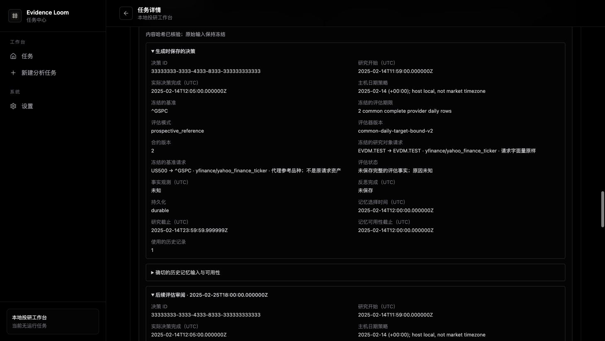

# Frozen Memory reference requests — 2026-10-04

This candidate adds the [nested EvaluationContract v2](../MEMORY_TARGET_BINDING.md)
on top of PR #88 (base `01e76f9`). The outer Memory, Evidence, report and review
envelopes retain their inherited versions. All validation uses fictional saved
inputs and makes no provider/model requests. The professional product objective
remains open.

## Behavior and boundaries

New research freezes both original selectors, literal Yahoo requests, request
namespace, syntax/proxy relations, UTC start, complete policy artifact and
adapter/resolver source identities before retrieval. Checkpoints and completed
reports require the binding in both Memory and the Evidence manifest. An
identical request shares one physical saved observation within an evaluation;
the compared source body preserves every exact number lexeme. A proxy return
does not establish the requested asset's performance or a provider entity.

The bare policy file SHA-256 is
`f6879792d66060d2000985f9d86f97b381810ae1146f1f5b487cbc37832be669`.
The admitted complete policy artifact SHA-256 is
`b76b4c71e3dd367e356e9762cb656628f174241607e00d99c7dfa5f75cbebfc2`.
The shared fixture is 58,352 bytes, SHA-256
`a6290b809a5dc37705ecdcbf907dd5db18caf4a2b924feba373b2b43f9a67649`;
its 30 target and five shared-observation cases are independently exercised.
Inherited Numeric/Identity policies and old Memory/Identity fixtures are not
regenerated. No dependency locks or native database schema change.

Old completed v1 outcomes retain the exact archived evaluator for offline replay.
Old pending v1 decisions retain `outcome:null` and unknown frozen-target
eligibility; no new price retrieval or reflection is permitted. New model use,
including resumed checkpoints and previously selected contexts, requires
admitted-code eligibility and independent full arithmetic replay. Historical
display/inventory/export validates structure, references and hashes; a coherent
imported false calculation can remain forensic data without acquiring model-use
authority. JSON exports explicitly state that narrower verification scope outside
the frozen bundle.

A durable per-instrument cursor selects at most five eligible UUIDs circularly
across restarts. A nonblocking group lock covers the batch, and each Decision is
reloaded under that lock before settlement. Independent delayed-list concurrency
checks permit one reflection rather than duplicate settlement; separate subprocess
checks exercise lock contention and cursor persistence. Legacy and unsupported
records do not consume the five-record batch.

Completed version/run ownership is immutable across browser storage and SQLite
schema 10. Retained v1 UUIDs cannot be rewritten as v2; selected historical
versions keep their own original bodies. Later review saves publish only after
durable success. Mounted TaskCenterProvider callbacks with an injected
`QuotaExceededError` and actual save/load entry points with mixed Memory/legacy
duplicate version IDs reproduced failures during review. Durable-first writes
and complete owner scans correct them; independent callback/save/load replay
confirms rejection without publishing an unsaved review or losing original bytes.

CLI and compact completion boundaries also bind the exact original report text,
typed rating, ticker and attachment chronology before publication. CLI exports
include complete Memory and Evidence sidecars and Markdown bodies; sanitization
cannot silently publish changed prose beside the old frozen decision.

## Local source and packaged validation

| Check | Result |
| --- | --- |
| Full Python suite | 1,456 passed, 75 subtests passed, one integration deselected; 307.55 seconds |
| Python lint/format | Ruff check and 195-file format check passed |
| Native source suite | 106 passed, two deliberate packaged tests ordinarily ignored; 5.84 seconds |
| Native checks | rustfmt and all-target Clippy with warnings denied passed |
| Full frontend suite | 565 passed in 40 files; 4.39 seconds |
| Frontend checks/builds | Full ESLint and TypeScript checks passed; standalone production build 19.553 seconds, Tauri static build 8.999 seconds |
| Actual packaged bootstrap + research import | Passed within the unchanged shared 90-second deadline; 85.602 seconds |
| Actual packaged native runtime bridge | Passed; 55.145 seconds including command overhead |
| Actual packaged native saved-Memory inventory | Passed; 16.870 seconds |
| Actual packaged v2/legacy inventory | Passed; two exact snapshots, 22.854 seconds, one attempt within 90 seconds |

The Python suite retains eight known unknown-model warnings. Native tests include
transactional missing/null marker rejection, explicit invalid diagnostic
preservation, completed body immutability, same-UUID legacy replacement rejection,
review append and owner deletion/receipt cleanup. A Windows exact-module compile
and Clippy pass includes the target helper but does not execute Windows SQLite
or the desktop; final native platform CI remains required.

The isolated Rosetta x86_64 runner is 54,036,512 bytes, SHA-256
`e868c8e3db4040b04b618a8e042240b891a5e984859b65f9079e0167701d811b`.
Its 98 readable research sources and 108 compiled owned CLI/research modules
match the candidate, including the new target, adapter, archived evaluator and
publication modules. The separately audited compiled desktop entrypoint and
three server helpers match as well. The actual packaged manifest reports core
SHA-256 `f7a75949fd22f0b3faf70cd46cb6c6d654e3110245b53ad92ba756da6da7981d`
and prompt SHA-256 `13b7859a609a7b84fdc7d221fcc7544668c3f739c845948a161ce2fb95a3ae9d`.

The v2 inventory protocol returns the later available snapshot while retaining
the original pending completion and complete archived v1 snapshot exactly.
Owned store/isolation file hashes and the binary remain unchanged. Its allowlisted
environment excludes provider credentials, inherited home/profile variables and
PYTHONPATH; dotenv/tracing are disabled. This proves packaged read behavior, not
arithmetic replay, an installer or native UI acceptance. Native bridge probes
select this actual binary explicitly while using prior read-only frontend assets
for compilation. New frontend production/static build and browser proof are
recorded separately. The original workspace and its packaged runner are untouched.
Startup durations are single local measurements, not a performance guarantee.

## Browser and export acceptance

The final standalone production build was served on its own local origin with
three fictional archive tasks. The selected v2 pane shows literal instrument and
benchmark requests, complete namespace/relations, original pending completion
and the exact frozen prior context. Its completed-v1 input includes the original
legacy target-uncertainty line. Switching to an older version shows unknown
attachment absence and exports that version; switching back and reloading keeps
the original v2 completion. The current-task overview is a separate view.

A proxy benchmark case displays `US500 → ^GSPC` as a proxy reference and leaves
requested-asset performance unconfirmed. Its original as-generated outcome
remains null while a separate dated later attachment displays `available`.
Another pending v1 case displays `unknown · legacy_target_not_frozen` without
inventing a terminal outcome or adding target fields.

Eight actual downloads were checked independently: JSON/HTML/Markdown for each
v2 case, selected legacy-absence JSON and pending-v1 JSON. Complete Memory,
Evidence and later attachments equal their saved inputs in all three formats,
including original decision/context text and opaque full-precision payload
strings. JSON additionally preserves the exact selected report-section fields;
HTML renders Markdown rather than preserving its original syntax. JSON's derived
verification scope explicitly leaves arithmetic and new-model eligibility
unconfirmed. These are export integrity checks, not arithmetic certification.

A marked completed version missing Memory displays `reference_mismatch`.
All three export actions fail visibly and create zero new files. The own origin's
task storage is restored exactly to its initial `[]`; the tab and owned server
are closed. All 32 prior report downloads retain their size, mtime and SHA-256.
The [JSON record](2026-10-04-memory-target-binding.json) retains source, build,
probe, independent-review, DOM, screenshot and actual-download hashes.

## Limits

Frozen requests establish neither provider-returned entity identity nor historical
listing, ticker reuse, publication availability, adjustment vintage, independent
exchange calendars, continuous-futures rolls or realized profit. The admitted
adapter's boolean/string parameters are covered; arbitrary imported numeric
parameter-type compatibility is not established. Price source bodies retain
their exact numerical lexemes. Independent claim/formula adjudication, research
evaluation, expert analyst tasks, accessibility/comparison, clean-install/upgrade,
release signing and complete startup performance acceptance remain open.

Required CI/review results must be checked against the final pull request head.
Local tests or a code-review quota notice do not substitute for those results.

